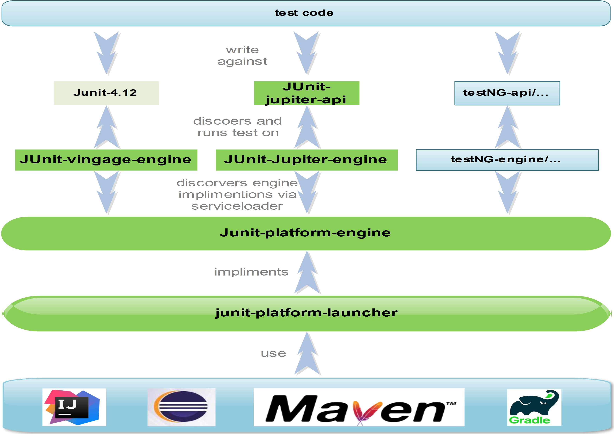

# Why JUnit 5

对Java程序员而言，JUnit 4无疑是使用最广泛的单元测试框架。自2006年初JUnit 4发布之后，最新的4.12版本是在2014年12月发布的。终于在JUnit 4发布11年后，JUnit 5在2017年10月份正式发布了。

先说一说JUnit 4。

众所周知，JUnit 4除了`hamcrest-core`一个外部依赖之外，所有的功能都包含在一个artifact中。这个artifact被提供给不同的开发者、IDE、构建工具、其它测试框架、其它扩展等使用，不同的使用者，依赖的都是一个同样的构件，这也完全违反了单一职责原则。

这种做法对一般应用开发者来说非常友好，他们通常只需要JUnit 4的公共 API，不需要管其他的细节。但是对于IT开发运作生态中其他开发者，比如IDE、构建工具、其他测试框架、其他扩展等工具开发者来说，他们需要深入到JUnit 4的深处，到它的细枝末节：非public的类、内部API，甚至private字段。它们的正常工作极大地依赖于JUnit 4的实现细节。这使得JUnit维护团队不能轻易地修改框架的这些内部实现，因此团队的开发进度受到了很大的影响。

当然，这些工具的开发者们为了实现那些一般开发者们喜爱的特性，他们不得不使用JUnit 4的内部API，因此JUnit 团队开始着手于JUnit 5的开发，希望能让这一切变得明朗起来。

JUnit 5的主要目标之一，就是使JUnit更易于做进一步的提高和改进。然而在JUnit 4时期，大量未内部构建而添加的接口被外部扩展和构建工具的开发人员违规使用，这使得JUnit 4很难改进。为解决该问题，JUnit 5中引入了一种用于所有公开接口、类和方法的预定生命周期。

此外，JUnit 5的另一个主要目标就是让JUnit 5尽可能的参入到编码客户端(构建工具和IDE)中，将发现和执行测试的内部构件和外部必需的所有过滤和配置分离开来。

对于一般应用开发者，JUnit 5有以下优点：

- JUnit 5中有一些列出色的新特性。
- JUnit 5提供了全新的框架，应用开发人员和工具开发人员可以各取所需，并且互不影响。
- JUnit 5提供了对旧版本的JUnit的兼容性，可以在运行JUnit 5测试的相同项目中运行旧版本JUnit的单元测试。
- JUnit 5提供了丰富的测试框架选择，其总体改进目标是让JUnit成功地使用其他测试框架。

# What is JUnit 5

## 概要

JUnit 5由三个子项目组成，分别是JUnit Platform、JUnit Jupiter和Junit Vintage。

- JUnit Platform是加载和启动测试框架的基础。此外它还定义了一个开发测试框架的TestEngine API,该API可用于开发在平台上运行的测试框架。
- JUnit Jupiter由新的编程模型和扩展（Extension）模型组成，用于编写JUnit 5中的测试和扩展。
- JUnit Vintage提供了运行JUnit 3和JUnit 4测试所用的TestEngine，为JUnit 5提供了后向兼容性。

根据用户指南，在JUnit 5中引入了一种称为“Launcher”的概念。Launcher用于发现、过滤和执行测试。第三方软件库可以提供定制的TestEngine方式，以插件形式加入JUnit Platform的Launcher架构中。

JUnit 5在运行时需要Java 8及以上版本。

## Artifacts简介

### `JUnit Platform`

- Group ID ： `org.junit.platform`
- Version : `1.2.0`
- Artifact IDs :

#### `junit-platform-commons`

JUnit 内部通用类库/实用工具，它们仅用于JUnit框架本身，不支持任何外部使用。

#### `junit-platform-console`

用来支持从控制台中发现和执行JUnit Platform上的测试。

#### `junit-platform-engine`

测试引擎的公共API，包含了一套所有测试引擎都必须实现的API。这样，不同的测试引擎之间可以通过统一的接口被调用。Junit 5内置了两种开箱即用的TestEngine：

- junit-jupiter-engine: JUnit Jupiter的核心，专门用于执行JUnit 5编写的测试。
- junit-vintage-engine: 专门用于执行JUnit 3或JUnit 4编写的测试。

#### `junit-platform-surefire-provider`

支持使用`Maven Surefire`插件在`mvn test`命令时发现和执行JUnit Platform上的测试。

#### `junit-platform-gradle-plugin`

支持使用Gralde来发现和执行JUnit Platform上的测试。

#### `junit-platform-launcher`

`junit-platform-launcher`是JUnit 5中用来发现， 过滤和执行测试，是JUnit 5参入到编码客户端即基础支持API。它提供了一套API给IDE和构建工具，使得它们能够与测试执行过程交互，比如运行单个的测试、搜集测试结果并展示等。

#### 其他

包括`junit-platform-console-standalone`、`junit-platform-runner`和`junit-platform-suite-api`等，这里不再详细描述。

### `JUnit Jupiter`

- Group ID: org.junit.jupiter
- Version: 5.2.0
- Artifact IDs:

#### `junit-jupiter-api`

编写测试和扩展的JUnit Jupiter API。

#### `junit-jupiter-engine`

JUnit Jupiter对`junit-platform-engine`测试引擎的实现，用于执行基于JUnit 5的测试。

#### `junit-jupiter-params`

用来支持JUnit Jupiter的参数化测试。

#### `junit-jupiter-migration-support`

支持从JUnit 4迁移到JUnit Jupiter，仅在使用了JUnit 4规则的测试中才需要。

### `JUnit Vintage`

- Group ID: org.junit.vintage
- Version: 5.2.0
- Artifact ID:

#### `junit-vintage-engine`

JUnit Vintage测试引擎实现，允许在新的JUnit Platform上运行低版本的JUnit测试，即那些以JUnit 3或JUnit 4风格编写的测试。

### 小结

综上所述，JUnit 5各部分关系可以用下图概括：

# How to Use Junit 5

本节我们使用IDEA + Maven来演示如何使用JUnit 5编写单元测试。

## 使用JUnit Jupiter编写测试内容

