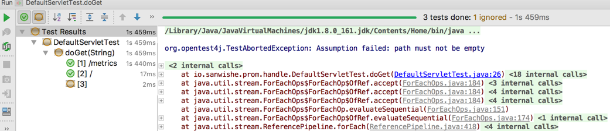

# Why JUnit 5

对Java程序员而言，JUnit 4无疑是使用最广泛的单元测试框架。自2006年初JUnit 4发布之后，最新的4.12版本是在2014年12月发布的。终于在JUnit 4发布11年后，JUnit 5在2017年10月份正式发布了。

先说一说JUnit 4。

众所周知，JUnit 4除了`hamcrest-core`一个外部依赖之外，所有的功能都包含在一个artifact中。这个artifact被提供给不同的开发者、IDE、构建工具、其它测试框架、其它扩展等使用，不同的使用者，依赖的都是一个同样的构件，这也完全违反了单一职责原则。

这种做法对一般应用开发者来说非常友好，他们通常只需要JUnit 4的公共 API，不需要管其他的细节。但是对于IT开发运作生态中其他开发者，比如IDE、构建工具、其他测试框架、其他扩展等工具开发者来说，他们需要深入到JUnit 4的深处，到它的细枝末节：非public的类、内部API，甚至private字段。它们的正常工作极大地依赖于JUnit 4的实现细节。这使得JUnit维护团队不能轻易地修改框架的这些内部实现，因此团队的开发进度受到了很大的影响。

当然，这些工具的开发者们为了实现那些一般开发者们喜爱的特性，他们不得不使用JUnit 4的内部API，因此JUnit 团队开始着手于JUnit 5的开发，希望能让这一切变得明朗起来。

JUnit 5的主要目标之一，就是使JUnit更易于做进一步的提高和改进。然而在JUnit 4时期，大量未内部构建而添加的接口被外部扩展和构建工具的开发人员违规使用，这使得JUnit 4很难改进。为解决该问题，JUnit 5中引入了一种用于所有公开接口、类和方法的预定生命周期。

此外，JUnit 5的另一个主要目标就是让JUnit 5尽可能的参入到编码客户端(构建工具和IDE)中，将发现和执行测试的内部构件和外部必需的所有过滤和配置分离开来。

对于一般应用开发者，JUnit 5有以下优点：

- JUnit 5中有一些列出色的新特性。
- JUnit 5提供了全新的框架，应用开发人员和工具开发人员可以各取所需，并且互不影响。
- JUnit 5提供了对旧版本的JUnit的兼容性，可以在运行JUnit 5测试的相同项目中运行旧版本JUnit的单元测试。
- JUnit 5提供了丰富的测试框架选择，其总体改进目标是让JUnit成功地使用其他测试框架。
- 开放测试联盟，JUnit 5统一了执行期间抛出的异常的不同。

其中，JUnit 5的新特性包括：

  - 新注解：JUnit 5继承了JUnit 4灵活使用注解的优点，同时增添了很多新的注解，如`@Nested`允许在一个测试类中创建相关测试类的嵌套组,`@Tag`允许为单元测试类和方法添加标签名称，使过滤机制能根据这些标签来跳过某个类或类中的测试，等。
  - 增加了对lambda的支持：Junit 5的断言（Assertions）和前置条件（Assumptions）与java 8 Lambda相结合，可以编写出更紧凑的测试。
  - JUnit 5扩展模型可以在单元测试生命周期每一个周期特定点执行扩张代码，以对代码执行事前和事后测试，甚至控制是否运行测试。
  - JUnit 5允许测试方法有参数，并通过`arameterResolver`接口在测试运行时解析参数。

# What is JUnit 5

## 概要

JUnit 5由三个子项目组成，分别是JUnit Platform、JUnit Jupiter和Junit Vintage。

- JUnit Platform是加载和启动测试框架的基础。此外它还定义了一个开发测试框架的TestEngine API,该API可用于开发在平台上运行的测试框架。
- JUnit Jupiter由新的编程模型和扩展（Extension）模型组成，用于编写JUnit 5中的测试和扩展。
- JUnit Vintage提供了运行JUnit 3和JUnit 4测试所用的TestEngine，为JUnit 5提供了后向兼容性。

根据用户指南，在JUnit 5中引入了一种称为“Launcher”的概念。Launcher用于发现、过滤和执行测试。第三方软件库可以提供定制的TestEngine方式，以插件形式加入JUnit Platform的Launcher架构中。

JUnit 5在运行时需要Java 8及以上版本。

## Artifacts简介

### `JUnit Platform`

- Group ID ： `org.junit.platform`
- Version : `1.2.0`
- Artifact IDs :

#### `junit-platform-commons`

JUnit 内部通用类库/实用工具，它们仅用于JUnit框架本身，不支持任何外部使用。

#### `junit-platform-console`

用来支持从控制台中发现和执行JUnit Platform上的测试。

#### `junit-platform-engine`

测试引擎的公共API，包含了一套所有测试引擎都必须实现的API。这样，不同的测试引擎之间可以通过统一的接口被调用。Junit 5内置了两种开箱即用的TestEngine：

- junit-jupiter-engine: JUnit Jupiter的核心，专门用于执行JUnit 5编写的测试。
- junit-vintage-engine: 专门用于执行JUnit 3或JUnit 4编写的测试。

#### `junit-platform-surefire-provider`

支持使用`Maven Surefire`插件在`mvn test`命令时发现和执行JUnit Platform上的测试。

#### `junit-platform-gradle-plugin`

支持使用Gralde来发现和执行JUnit Platform上的测试。

#### `junit-platform-launcher`

`junit-platform-launcher`是JUnit 5中用来发现， 过滤和执行测试，是JUnit 5参入到编码客户端即基础支持API。它提供了一套API给IDE和构建工具，使得它们能够与测试执行过程交互，比如运行单个的测试、搜集测试结果并展示等。

#### 其他

包括`junit-platform-console-standalone`、`junit-platform-runner`和`junit-platform-suite-api`等，这里不再详细描述。

### `JUnit Jupiter`

- Group ID: org.junit.jupiter
- Version: 5.2.0
- Artifact IDs:

#### `junit-jupiter-api`

编写测试和扩展的JUnit Jupiter API。

#### `junit-jupiter-engine`

JUnit Jupiter对`junit-platform-engine`测试引擎的实现，用于执行基于JUnit 5的测试。

#### `junit-jupiter-params`

用来支持JUnit Jupiter的参数化测试。

#### `junit-jupiter-migration-support`

支持从JUnit 4迁移到JUnit Jupiter，仅在使用了JUnit 4规则的测试中才需要。

### `JUnit Vintage`

- Group ID: org.junit.vintage
- Version: 5.2.0
- Artifact ID:

#### `junit-vintage-engine`

JUnit Vintage测试引擎实现，允许在新的JUnit Platform上运行低版本的JUnit测试，即那些以JUnit 3或JUnit 4风格编写的测试。

### 小结

综上所述，JUnit 5各部分关系可以用下图概括：


# How to Use Junit 5

本节我们使用IDEA + Maven来演示如何使用JUnit 5编写单元测试。

## 使用JUnit Jupiter编写测试内容

### 依赖配置

JUnit 5中，和应用开发者便携测试代码息息相关的核心API都被封装`junit-jupiter-api`里。因此应用开发人员使用JUnit 5编写测试代码的核心依赖只有一个artifact：

```xml
<dependency>
    <groupId>org.junit.jupiter</groupId>
    <artifactId>junit-jupiter-api</artifactId>
    <version>${junit.jupiter.version}</version>
    <scope>test</scope>
</dependency>
```

Tips： 这里建议使用artifact：`junit-jupiter-engine`替代之，原因后续第二小节再详细解释。

如果希望在代码中使用JUnit 5的参数化测试的新特性，需要在依赖中加入`junit-jupiter-params`

```xml
<dependency>
    <groupId>org.junit.jupiter</groupId>
    <artifactId>junit-jupiter-params</artifactId>
    <version>${junit.jupiter.version}</version>
    <scope>test</scope>
</dependency>
```

### 核心注解

JUnit 5继承了JUnit 4几乎全部注解，并且增加了大量新的注解。这里无法详细列出所有的注解，只是介绍一下常用注解。

表1 JUnit Jupiter常用注解

| Annotation | Target | Description |
|:----------:|:-------:|:-------:|
| @Test | Method | 表示被注解的方法是一个测试方法。与JUnit 4的`@Test`注解类似。 |
| @DisplayName | Class/Method | 为测试类或测试方法声明一个自定义的显示名称。 |
| @BeforeAll | Method | 表示使用了该注解的方法应该在当前类中所有测试方法之前执行，该方法必须为静态静态非private方法，而且返回值必须为void。它类似于JUnit 4的`@BeforeClass`。 |
| @AfterAll | Method | 和`@BeforeAll`相反，表示在该类中所有测试方法执行完成后执行该方法。类似JUnit 4中的`@AfterClass` |
| @BeforeEach | Method | 表示该方法需要在当前测试类每个测试方法执行前执行，类似JUnit 4中的`@Before` |
| @AfterEach | Method | 表示该方法需要在当前测试类每个测试方法执行之后执行，类似JUnit 4中的`@After` |
| @Disabled | Class/Method | 被注解的测试方法/类不会被执行，类似JUnit 4中的`@Ignore` |
---

表1列出的注解是一般应用开发者最常用的注解，一个使用上述注解的标准测试类如例1。

例1:

```java
@DisplayName("Testing using JUnit 5")
public class JUnit5AppTest {

  private App classUnderTest;

  @BeforeAll
  public static void init() {
    System.out.println("BeforeAll invoked.");
  }

  @AfterAll
  public static void done() {
    System.out.println("AfterAll invoked.");
  }

  @BeforeEach
  public void setUp() throws Exception {
    classUnderTest = new App();
  }

  @AfterEach
  public void tearDown() throws Exception {
    classUnderTest = null;
  }

  @Test
  @DisplayName("Dummy test")
  void aTest() {
    assertEquals(4, (2 + 2));
  }

  @Test
  @Disabled
  @DisplayName("A disabled test")
  void testNotRun() {
    log.info("This test will not run (it is disabled, silly).");
  }
}
```

Tips：

- JUnit Jupiter不需要将测试方法声明为public。
- 所有的测试方法的返回值都必须是`void`。

### 断言与假设

`org.junit.jupiter.api.Assertions`上内置了很多静态断言方法，如`assertTrue()`，`assertEquals()`等。相比较于JUnit 4，JUnit Jupiter的言改进之一在于其增加了对Java 8 Lambda的支持，可以在断言判断基础上传入一个`messageSupplier`，`messageSupplier`是一个`Supplier`的实例，用来为断言错误是提供一个错误消息，参考例2。

例2:

```java
@Test
@DisplayName("success branch")
public void testDoGetSuccess() throws ServletException, IOException {
    // given
    HttpServletRequest req = mock(HttpServletRequest.class);
    when(req.getParameterValues(anyString())).thenReturn(new String[]{"test_gauge"});
    HttpServletResponse resp = mock(HttpServletResponse.class);

    StringWriter writer = new StringWriter();
    PrintWriter printWriter = new PrintWriter(writer);
    when(resp.getWriter()).thenReturn(printWriter);

    // when
    new MetricsServlet().doGet(req, resp);

    // then
    assertTrue(writer.toString().contains("test_gauge 0.0"));
    assertTrue(resp.getStatus() == HttpStatus.OK_200, () -> "status must be ok");
    assertTrue(TextFormat.CONTENT_TYPE_004.equals(resp.getContentType()), () -> "response type must be prometheus text format: v0.0.4");
}
```

日常开发过程中，经常遇到某些场景下，测试用例的断言会非常多，如某些复杂算法的测试代码需要检验返回结果中的多个字段值是否符合预期。JUnit 4时期，我们需要使用断言逐个判断结果满足预期，由于一般的断言函数的错误会导致测试允许终止，调试时需要重复运行测试以保证所有断言都通过。JUnit Jupiter进入了`assertAll()`来解决这个问题。`assertAll()`可以将多个断言包含在内，所有断言都会执行，即使一个或多个断言失败测试代码执行也不会终止。

例2中三个断言，可以写在一起：

例3:

```java
// ...
assertAll("check all result:",
        () -> assertTrue(writer.toString().contains("test_gauge 0.0")),
        () -> assertTrue(resp.getStatus() == HttpStatus.OK_200, () -> "status must be ok"),
        () -> assertTrue(TextFormat.CONTENT_TYPE_004.equals(resp.getContentType()), () -> "response type must be prometheus text format: v0.0.4")
        );
```

例3执行结果(局部)：

```
org.opentest4j.MultipleFailuresError: check all result: (2 failures)
	status must be ok ==> expected: <true> but was: <false>
	response type must be prometheus text format: v0.0.4 ==> expected: <true> but was: <false>
```

虽然JUnit Jupiter提供的断言工具包已经满足了许多测试场景，但有时我们会遇到需要更加强大且具备例如匹配器 功能的场景。在这些场景中，JUnit团队推荐使用第三方断言类库，例如：AssertJ、Hamcrest、Truth 等等。因此，开发人员可以自由使用他们选择的断言类库。例如，匹配器 和流式调用的API组合起来使用可以让断言更加具有描述性和可读性。然而，JUnit Jupiter的`org.junit.jupiter.api.Assertions`类没有提供一个类似于JUnit 4的`org.junit.Assert`类中`assertThat()`方法，该方法接受一个`Hamcrest Matcher`。所以，我们鼓励开发人员使用由第三方断言库提供的匹配器的内置支持。

假设与断言类似，但假设不成立时，测试跳过。JUnit Jupiter附带了JUnit 4中所提供的假设方法的一个子集，并增加了一些适合与Java 8 lambda一起使用的假设方法。

例4：

```java
@ParameterizedTest
@ValueSource(strings = {"/metrics", "/", ""})
void doGet(String path) throws Exception {

    assumeTrue(!path.isEmpty(), () -> "path must not be empty");

    HttpServletRequest req = mock(HttpServletRequest.class);
    HttpServletResponse resp = mock(HttpServletResponse.class);
    StringWriter writer = new StringWriter();
    PrintWriter printWriter = new PrintWriter(writer);
    when(resp.getWriter()).thenReturn(printWriter);

    new DefaultServlet(path).doGet(req, resp);

//  assertTrue(resp.getStatus() == HttpStatus.OK_200, () -> "status must be ok");
    assertTrue(!writer.toString().isEmpty(), () -> "response message should not be empty");
}
```

在IDEA上执行例4，结果如图2。



断言和假设在某些方面很相似，那么是使用断言还是假设呢？
二者的区别可能很细微，所以可使用这条经验法则：使用断言检查一个测试方法的结果。使用假设确定是否运行测试方法。不会将已中止的测试报告为失败，意味着这种失败不会中断构建工作。

### 参数化测试

在某些场景下，我们需要保证合法的边界值通过测试，已验证极端情况，此时可以使用JUnit Jupiter的参数化测试。参数化测试可以用不同的参数多次运行试，它使用`@ParameterizedTest`注解，它们的声明跟@Test的方法没有区别，但是参数化测试还需要通过其它注解为测试方法注入参数集合。此外，参数化测试需要额外依赖`junit-jupiter-params`.

例4就是参数化测试的一个示例，示例中使用了`@ValueSource`来指定参数集合。但是JUnit Jupiter为我们提供了丰富的注解来为测试方法提供参数。

表2：

| Annotation | Description |
|:----:|:---:|
| @ValueSource | 是最简单的来源之一。它允许你指定单个数组的文字值目前支持基本类型和String，Class。 |
| @EnumSource | 通过为注解提供枚举类，让测试函数遍历枚举值。 |
| @MethodSource | 通过静态工厂方法为测试提供测试参数，静态工厂方法的返回值必须为数组、Stream、Iterable或者Iterator。 |
| @CsvSource | 它允许将参数列表定义为以逗号分隔的值。 |
| @CsvFileSource | 和`@CsvSource`类似，以csv文件方式传入测试参数。 |

tips：

- csv不允许“”
- 如果测试方法有多个参数，可以使用多为数组，或者是`Arguments`的集合


例4使用其它方式的传入参数的用法如下：

例5(使用`@MethodSource`，提供返回`Stream<String>`的静态工厂方法)

```java
private static Stream<String> paramProvider() {
    return Stream.of("/metrics", "/", "");
}

@ParameterizedTest
@MethodSource("paramProvider")
void doGet(String path) throws Exception {

    assumeTrue(!path.isEmpty(), () -> "path must not be empty");

    HttpServletRequest req = mock(HttpServletRequest.class);
    HttpServletResponse resp = mock(HttpServletResponse.class);
    StringWriter writer = new StringWriter();
    PrintWriter printWriter = new PrintWriter(writer);
    when(resp.getWriter()).thenReturn(printWriter);

    new DefaultServlet(path).doGet(req, resp);

    assertTrue(!writer.toString().isEmpty(), () -> "response message should not be empty");
}
```

例6(使用`@MethodSource`，提供返回数组的静态工厂方法)

```java
private static String[] paramProviderWithArray() {
    return new String[]{"/metrics", "/"};
}

@ParameterizedTest
@MethodSource("paramProviderWithArray")
void doGet(String path) throws Exception {

    assumeTrue(!path.isEmpty(), () -> "path must not be empty");

    HttpServletRequest req = mock(HttpServletRequest.class);
    HttpServletResponse resp = mock(HttpServletResponse.class);
    StringWriter writer = new StringWriter();
    PrintWriter printWriter = new PrintWriter(writer);
    when(resp.getWriter()).thenReturn(printWriter);

    new DefaultServlet(path).doGet(req, resp);

    assertTrue(!writer.toString().isEmpty(), () -> "response message should not be empty");
}
```

例7(使用`@CsvSource`提供参数)

```java
@ParameterizedTest
@CsvSource({"/metrics", "/"})
void doGet(String path) throws Exception {

    assumeTrue(!path.isEmpty(), () -> "path must not be empty");

    HttpServletRequest req = mock(HttpServletRequest.class);
    HttpServletResponse resp = mock(HttpServletResponse.class);
    StringWriter writer = new StringWriter();
    PrintWriter printWriter = new PrintWriter(writer);
    when(resp.getWriter()).thenReturn(printWriter);

    new DefaultServlet(path).doGet(req, resp);

    assertTrue(!writer.toString().isEmpty(), () -> "response message should not be empty");
}
```

前面讲述了为测试方法提供一些简单类型的参数的方法。如果测试参数是自定义的Object类型，也可以使用JUnit Jupiter进行测试。

to be continue